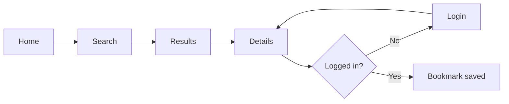
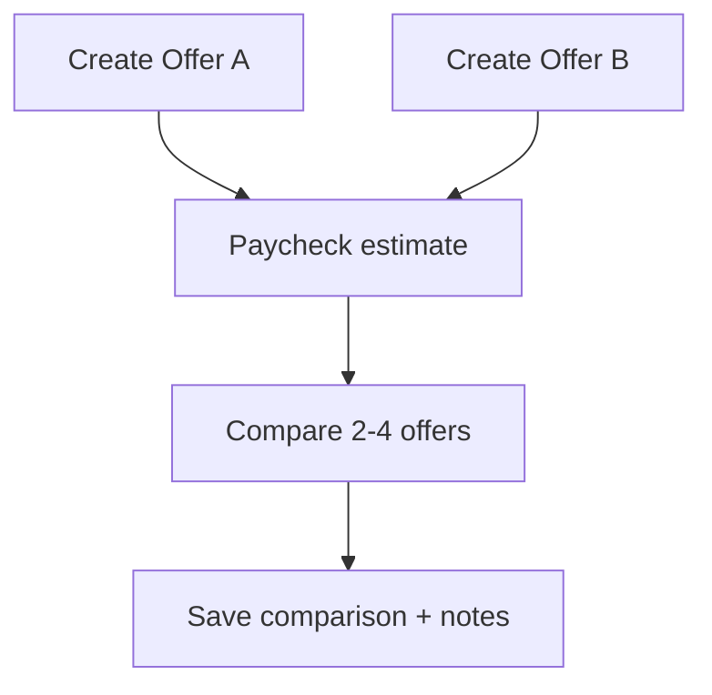

# Offer Comparison Dashboard — Extended Product Requirements Document

| Field | Value |
| ----- | ----- |
| **Product** | Offer Comparison Dashboard |
| **Codebase** | interntools.fyi (`apps/web`, `apps/api`) |
| **Document type** | Extended PRD (feature-level depth) |
| **Version** | 1.0 |
| **Status** | Draft |
| **Last updated** | March 2026 |
| **Owner** | Product / Engineering |
| **Related** | Root [`README.md`](../README.md) (canonical PRD summary + repo notes) |

---

## Document purpose

This document is the **deep specification** for the Offer Comparison Dashboard: the same product described in the repository root PRD, expanded with **personas**, **journeys**, **screen-level acceptance criteria**, **data contracts**, **API sketches**, **phasing**, **risks**, and **open questions**. It is meant for engineers, designers, and reviewers who need more than a one-page overview.

**How to use it**

- **PM / design:** Journeys (§4), UX principles (§5), screen specs (§6), content (§14).
- **Frontend:** Routes & URL state (§7), UI states (§6.10), analytics (§15).
- **Backend:** Entities (§8), API outline (§9), authz matrix (§10).
- **Compliance / risk:** Privacy & security (§11), data retention (§11.4).

---

## Table of contents

1. [Executive summary](#1-executive-summary)
2. [Problem, opportunity, and positioning](#2-problem-opportunity-and-positioning)
3. [Goals, non-goals, and success metrics](#3-goals-non-goals-and-success-metrics)
4. [Users, personas, and journeys](#4-users-personas-and-journeys)
5. [Product principles and UX standards](#5-product-principles-and-ux-standards)
6. [Functional specification by area](#6-functional-specification-by-area)
7. [Routing, navigation, and URL contract](#7-routing-navigation-and-url-contract)
8. [Data model (extended)](#8-data-model-extended)
9. [API contract (outline)](#9-api-contract-outline)
10. [Authorization matrix](#10-authorization-matrix)
11. [Privacy, security, and compliance](#11-privacy-security-and-compliance)
12. [Non-functional requirements (extended)](#12-non-functional-requirements-extended)
13. [External integrations](#13-external-integrations)
14. [Copy, empty states, and errors](#14-copy-empty-states-and-errors)
15. [Analytics and experimentation](#15-analytics-and-experimentation)
16. [Phased delivery plan](#16-phased-delivery-plan)
17. [Risks, dependencies, and mitigations](#17-risks-dependencies-and-mitigations)
18. [Open questions and decision log](#18-open-questions-and-decision-log)
19. [Glossary](#19-glossary)
20. [Appendix A — Journey diagrams (Mermaid)](#appendix-a--journey-diagrams-mermaid)

---

## 1. Executive summary

### 1.1 What we are building

The **Offer Comparison Dashboard** is a web application that helps people compare **job and internship offers** not only by gross pay, but by **estimated take-home pay**, **rent and living-cost context**, **commute impact**, and **saved notes**—so users can answer:

> *Given where I would live and work, which offer gives the best real lifestyle and financial outcome?*

The product is **not** a rental marketplace. It is **decision support**: unify paycheck math, external location/listing/commute data from at least one remote API, and user-generated bookmarks and notes.

### 1.2 Why now

Students and early-career candidates routinely juggle spreadsheets, tax calculators, map tabs, and listing sites. That workflow is **error-prone** and **slow**. A single dashboard with **clear URLs**, **saved scenarios**, and **comparable metrics** reduces cognitive load and builds trust.

### 1.3 MVP definition (one paragraph)

Ship **authentication**, **offer CRUD**, **paycheck estimation** (existing calculator path can evolve), **remote search + details** for location, rent, and commute-related data, **bookmarks and notes** tied to offers and external results, **side-by-side comparison** for 2–4 offers with computed affordability signals, **profile** surfaces for saved content, **admin moderation** for public UGC, and **responsive UI** with **privacy policy** and **first-visit privacy acknowledgement**.

---

## 2. Problem, opportunity, and positioning

### 2.1 Problem statement (expanded)

| Pain | Evidence (qualitative) | Product response |
| ---- | ---------------------- | ---------------- |
| Headline salary bias | Users anchor on base pay or hourly rate | Show net pay + monthly leftover alongside gross |
| Tax confusion | Multi-state offers confuse withholding | State-aware estimate with clear assumptions |
| Rent unknowns | Users guess rent or use one listing | Search API + saved rent assumptions per offer/city |
| Commute ignored | “20 min” vs “90 min” not in the same spreadsheet | Store commute minutes/cost per offer–place pair |
| Fragmented notes | Opinions live in Notes apps | Notes/reviews on offers, places, comparisons |
| No single “winner” | Hard to weigh tradeoffs | Comparison outputs: best savings, best commute, user pick |

### 2.2 Positioning statement

**For** students and early-career professionals **who** are choosing between offers in different cities, **the Offer Comparison Dashboard** is a **decision-support web app** that **combines paycheck estimates, location research, and affordability metrics in one place**, **unlike** ad-heavy listing sites or single-purpose calculators **because** it ties **compensation to place-specific costs and personal notes**.

### 2.3 Competitive landscape (conceptual)

| Category | Examples (generic) | Our differentiation |
| -------- | ------------------ | --------------------- |
| Pay calculators | Many tax/pay sites | Offers + multi-offer compare + save |
| Listing portals | Rental aggregators | We don’t optimize for lease conversion; we optimize for **decision framing** |
| Employer review sites | Glassdoor-class | We focus on **your** offers and **your** scenarios, not employer reputation (MVP) |
| Spreadsheets | Excel / Sheets | Guided UX, URL state, APIs, collaboration-ready later |

---

## 3. Goals, non-goals, and success metrics

### 3.1 Product goals

1. **Clarity:** Users can see **monthly take-home** and **estimated leftover** after rent and commute for each offer in a comparison set.
2. **Speed:** From landing to **first saved comparison** in under **10 minutes** for a motivated user (usability target, not a hard SLA).
3. **Trust:** Assumptions and disclaimers are visible; users know what is **estimated** vs **sourced from an API**.
4. **Persistence:** Logged-in users can **return** to offers, places, and comparisons without re-entering data.
5. **Safety:** Public content is **moderatable**; PII is **minimized** and **redacted** on public profiles.

### 3.2 Non-goals (MVP)

- Visa / work-authorization automation beyond static copy or links.
- Direct lease applications or payments.
- Real-time payroll or HR system integrations.
- Investment, retirement, or equity valuation beyond simple optional fields.
- Full social graph or feed-based network.
- ML-based “best offer” as a black box (optional **user-defined weights** are in scope; opaque ML is not).

### 3.3 Success metrics (measurable)

| Metric | Definition | Target (post-launch pilot) |
| ------ | ---------- | -------------------------- |
| Activation | User creates ≥2 offers | ≥40% of registered users in pilot cohort |
| Search engagement | User runs ≥1 search and opens ≥1 detail | ≥50% of activated users |
| Save | User bookmarks a place or saves a comparison | ≥30% of activated users |
| Comparison | User completes a 2+ offer comparison view | ≥35% of activated users |
| Retention | Return within 7 days | Benchmark TBD; track week-over-week |
| NPS / CSAT | In-product micro-survey | Track; target set after baseline |

### 3.4 Guardrail metrics

- Time-to-interactive on search results (p95)
- Error rate on paycheck API
- External API failure rate and cache hit rate
- Moderation queue time (admin)

---

## 4. Users, personas, and journeys

### 4.1 Primary personas

#### Persona A — “Sam” (summer intern, multiple metros)

- **Context:** Two SWE intern offers (e.g., Bay Area vs Seattle).
- **Needs:** Net pay, rent sanity check, commute to office, save decision notes.
- **Behaviors:** Mobile + laptop; shares links with parents/friends.

#### Persona B — “Riley” (new grad, relocation)

- **Context:** Full-time offers with different base and bonus structures.
- **Needs:** Monthly budgeting, comparison table, optional equity field for record-keeping.
- **Behaviors:** Desktop-heavy; cares about PDF offer letter alignment.

#### Persona C — “Jordan” (admin / TA for a student org)

- **Context:** Needs to remove spam reviews or featured city abuse.
- **Needs:** Moderation queue, audit visibility, featured content control.

### 4.2 Key user journeys (narrative)

#### Journey 1 — Anonymous discovery → account → save

1. Land on **home**; read value prop; try **search** without login (if policy allows) or see CTA to register.
2. Run **search** with criteria in URL; open **details** for one result.
3. Hit **bookmark** or **save comparison** → **login/register** gate.
4. After auth, **resume** the intended action (deep link).

**Requirement:** Post-login redirect returns user to prior URL with intent preserved (query param or session storage fallback).

#### Journey 2 — Offer entry → paycheck → compare

1. Create **offer A** (company, location, pay type, amount, schedule notes).
2. Run **paycheck estimate** (inline or linked calculator) and **attach** result to offer or save scenario id.
3. Repeat for **offer B**.
4. Open **compare**; select offers A+B; add **rent assumption** per offer (manual or from saved place).
5. Review **metrics** and mark **user winner** + private notes.

#### Journey 3 — Location research parallel path

1. **Search** for neighborhood/listing/city per external API.
2. **Bookmark** result; set optional **rent estimate override** for that bookmark.
3. Link bookmark to **comparison** or **offer** (association model—see §8).
4. **Profile** shows saved places and linked comparisons.

### 4.3 Journey diagrams

See [Appendix A](#appendix-a--journey-diagrams-mermaid).

---

## 5. Product principles and UX standards

1. **Numbers have footnotes:** Every estimate shows **assumptions** (state, filing status if applicable, pay frequency).
2. **URL is state:** Search and comparison filters should be **shareable** and **back-button safe** where possible.
3. **No dead ends:** Global nav always offers **Home**, **Search**, **Account/Login**, and entry to **Offers/Compare** when authenticated.
4. **Progressive disclosure:** Novices see simple fields; advanced users can expand equity, relocation, schedule.
5. **Respect cognitive load:** Default compare view shows **at most 4** offers; horizontal scroll on mobile is acceptable if headers stay visible.
6. **Accessible by default:** WCAG 2.1 AA targets for text, focus, forms (see §12).

---

## 6. Functional specification by area

### 6.1 Home (`/` or `/home`)

**Purpose:** Explain the product; route anonymous and authenticated users to next actions.

**Content blocks**

| Block | Anonymous | Logged-in |
| ----- | --------- | --------- |
| Hero | Value prop + primary CTA (search / get started) | Personalized greeting optional |
| Search entry | Prominent search bar or CTA to `/search` | Same + shortcuts |
| Featured | Featured cities (admin-curated) | Recent offers, last comparison |
| Social proof | Recent **public** reviews (if any) | Recent notes (private snippets only to owner) |
| Footer | Legal, privacy | Same |

**Acceptance criteria**

- [ ] LCP within target budget on 4G (see §12).
- [ ] First interactive element in logical tab order is **skip-to-content** or **main CTA**.
- [ ] Links to `/privacy` and login/signup visible without scroll on desktop.

---

### 6.2 Authentication (`/login`, `/register` or `/signup`)

**Flows:** Register, login, logout, password visibility toggle, session persistence.

**Acceptance criteria**

- [ ] Register collects **username**, **email**, **password** (min complexity policy defined in backend).
- [ ] Login supports **username or email** as identifier (aligned with backend).
- [ ] Logout clears client tokens and invalidates server session per API contract.
- [ ] Protected routes show **unauthorized** state or redirect to login with `returnUrl`.

**Implementation note:** This repo may use `/signup` instead of `/register`; PRD accepts either but **one canonical route** should be chosen and redirects added.

---

### 6.3 Offer dashboard and CRUD

**Routes (target):** `/offers`, `/offers/new`, `/offers/{offerId}/edit`

**Fields (MVP)**

| Field | Type | Required | Notes |
| ----- | ---- | -------- | ----- |
| company | string | yes | Display name |
| title | string | yes | Role title |
| employmentType | enum | yes | `internship`, `full_time` |
| compensationType | enum | yes | `hourly`, `salary` |
| payAmount | decimal | yes | Annual salary or hourly per business rules |
| hoursPerWeek | decimal | conditional | If hourly |
| signOnBonus | decimal | no | One-time |
| relocationAmount | decimal | no | One-time |
| equityNotes | string | no | Free text; no valuation engine in MVP |
| officeLocation | string | yes | Address or “City, ST” |
| daysInOffice | string or enum | no | e.g. hybrid pattern |
| notes | text | no | Private to user |
| favorite | boolean | no | Sort/filter aid |

**Acceptance criteria**

- [ ] User can **list** all offers with sort by updated date.
- [ ] User can **delete** with confirmation; deletion removes from comparisons or prompts cascade rules (define: **remove from comparison** or **block delete** if referenced—product decision in §18).
- [ ] Validation errors are inline and summarized.

---

### 6.4 Paycheck estimation

**Integration:** Existing calculator (`/calculator`) evolves into or links from offer flow.

**Acceptance criteria**

- [ ] Estimate available **without login** (stateless API).
- [ ] Logged-in user can **save scenario** linked to user id (existing `/paycheck/scenarios` pattern).
- [ ] Offer edit UI can **apply** a saved scenario or re-run estimate with prefilled fields from offer.

---

### 6.5 Search and results (`/search`, `/search?criteria=...`)

**Behavior**

- Query parameters encode **criteria** (city, bounds, price max, etc.—exact schema depends on provider).
- Results are **cards** with: title, key stats (rent/commute/amenities as available), CTA to details, bookmark affordance.

**States**

- Loading skeleton
- Empty (“Try broader filters”)
- Error upstream (“Provider unavailable—retry”)

**Acceptance criteria**

- [ ] Criteria reflected in URL; refresh restores results request.
- [ ] Pagination or infinite scroll; URL encodes page/cursor if applicable.

---

### 6.6 Details page (`/details/{id}`)

**Behavior**

- `id` is **external** identifier from provider (stable string).
- Page fetches **remote detail**; merges **local**: bookmark count, user’s bookmark state, reviews.

**Acceptance criteria**

- [ ] Invalid id shows **404** or provider **not found** message.
- [ ] Public reviews list supports pagination.
- [ ] Authenticated user can add **review/note** with visibility **private** or **public** (if public allowed).

---

### 6.7 Comparison view (`/compare`)

**Behavior**

- Select 2–4 offers from user’s library.
- Metrics columns:

| Metric | Source |
| ------ | ------ |
| Gross compensation | Offer fields |
| Est. monthly take-home | Paycheck engine |
| Est. rent | User input or saved place |
| Commute time/cost | User input or API |
| Monthly leftover | Derived |
| Affordability ratio | rent / net (define cap display) |
| Custom score | Optional user weighting (slider) later |

**Outputs**

- Labels: “Best for savings”, “Best commute”, “Best affordability” (deterministic rules in §18).
- User-selected winner stored on comparison record.

**Acceptance criteria**

- [ ] Comparison is **saveable** with a **name**.
- [ ] Shareable read-only link **out of scope** for MVP unless trivial (flag in §18).

---

### 6.8 Saved hub (`/saved`)

Aggregates bookmarks, saved comparisons, recent notes—may fold into **profile** initially.

**Acceptance criteria**

- [ ] Clear tabs: Places | Comparisons | Notes.

---

### 6.9 Profile (`/profile`, `/profile/{profileId}`)

**Owner view**

- Editable profile fields; private email/phone hidden from others.
- Lists: offers, saved places, comparisons, reviews.

**Public view**

- Show only **public** activity; redact email/phone; optional avatar/bio.

**Acceptance criteria**

- [ ] Direct navigation to another user’s public profile works.
- [ ] 404 for nonexistent user.

---

### 6.10 Admin (`/admin`, `/admin/moderation`, `/admin/featured`)

**Features**

- Queue of flagged content; actions: dismiss, hide, delete.
- Featured cities/locations: CRUD lightweight records pointing to external ids or labels.

**Acceptance criteria**

- [ ] Admin routes blocked for non-admin (403).
- [ ] Audit log entry for destructive actions (align with backend).

---

## 7. Routing, navigation, and URL contract

### 7.1 Public routes

| Path | Description |
| ---- | ----------- |
| `/` | Home |
| `/home` | Alias → same as home |
| `/login` | Login |
| `/register` or `/signup` | Register (canonical TBD) |
| `/search` | Search |
| `/search?...` | Results |
| `/details/{id}` | Detail |
| `/profile/{profileId}` | Public profile |
| `/privacy` | Privacy policy |

### 7.2 Authenticated routes

| Path | Description |
| ---- | ----------- |
| `/profile` | Me |
| `/offers` | List |
| `/offers/new` | Create |
| `/offers/{id}/edit` | Edit |
| `/compare` | Compare |
| `/saved` | Saved items |

### 7.3 Legacy / redirects

| Path | Behavior |
| ---- | -------- |
| *(obsolete marketing URLs)* | Prefer `/search`; no dedicated redirect layer required in MVP |

### 7.4 Deep linking

- **returnUrl** query param after login: must preserve `/search?...` and `/details/{id}` intents.

---

## 8. Data model (extended)

### 8.1 Core entities (logical)

**User** — id, username, email, password hash, role, profile photo URL, bio, createdAt.

**StandardUserProfile** (1:1 or embedded) — targetRentPct, preferredCommuteMinutes, preferredCity, savingsGoalMonthly.

**AdminProfile** — permission flags, moderation scope.

**Offer** — see §6.3; userId FK; timestamps.

**SavedPlace** — userId, externalPlaceId, title snapshot, location snapshot, rentEstimate, rawMetadata JSON, createdAt.

**Comparison** — userId, name, includedOfferIds (ordered), includedPlaceIds optional, computedMetrics JSON, userSelectedWinnerOfferId nullable, notes.

**ReviewNote** — userId, targetType (`offer` | `place` | `comparison`), targetId, body, visibility (`private` | `public`), createdAt, editedAt.

**FeaturedLocation** (admin) — label, externalPlaceId optional, city slug, sort order, active flag.

**ModerationFlag** — reporterId, targetType, targetId, reason, status, createdAt.

### 8.2 Relationship summary

- User 1—N Offer  
- User 1—N Comparison  
- User 1—N SavedPlace  
- User 1—N ReviewNote  
- Comparison N—M Offer (via ordered list or join table)  
- Many users bookmark many external places (SavedPlace uniqueness on userId + externalPlaceId)

### 8.3 Indexing notes

- Index `(userId, updatedAt DESC)` on Offer and Comparison.
- Index `(externalPlaceId)` on SavedPlace for aggregation.
- Unique `(userId, externalPlaceId)` on SavedPlace.

---

## 9. API contract (outline)

Prefix: `/api`. Auth: `Authorization: Bearer <JWT>` unless noted.

### 9.1 Auth & users

- `POST /auth/register`, `POST /auth/login`, `POST /auth/logout`, `GET /me`
- `GET/PATCH /profiles/me`, `GET /profiles/:id`

### 9.2 Offers

- `GET /offers` (auth) — list mine  
- `POST /offers` (auth)  
- `GET /offers/:id` (auth)  
- `PATCH /offers/:id` (auth)  
- `DELETE /offers/:id` (auth)

*Version note:* Align with existing Spring modules; paths above are **target** REST shape.

### 9.3 Paycheck

- `POST /paycheck/estimate` (public)
- `GET/POST /paycheck/scenarios` (auth)

### 9.4 Places / bookmarks / reviews (`/api/places/*` target shape)

- Bookmark and review by **external id** — see [`apps/api/README.md`](../apps/api/README.md).

### 9.5 Comparisons

- `GET /comparisons` (auth)
- `POST /comparisons` (auth)
- `GET /comparisons/:id` (auth)
- `PATCH /comparisons/:id` (auth)
- `DELETE /comparisons/:id` (auth)

### 9.6 Admin

- `GET /admin/flags`, `POST /admin/.../resolve`, featured CRUD under `/admin/featured`

**Error envelope (consistent)**

```json
{
  "errorCode": "STRING_CODE",
  "message": "Human readable",
  "fields": { "field": "reason" },
  "requestId": "uuid"
}
```

---

## 10. Authorization matrix

| Action | Anonymous | User | Admin |
| ------ | --------- | ---- | ----- |
| View home, privacy | ✓ | ✓ | ✓ |
| Paycheck estimate | ✓ | ✓ | ✓ |
| Search & details (public data) | ✓ | ✓ | ✓ |
| Create/save offer | ✗ | ✓ | ✓ |
| Bookmark / note (private) | ✗ | ✓ | ✓ |
| Public review | ✗ | ✓ | ✓ |
| Moderate | ✗ | ✗ | ✓ |

---

## 11. Privacy, security, and compliance

### 11.1 Data classes

- **Public:** username, public bio, public reviews.
- **Private:** email, phone, private notes, draft comparisons (if marked private).
- **Operational:** IPs, request logs—minimize retention.

### 11.2 Security controls

- Passwords hashed (bcrypt/argon2—backend choice); never log passwords.
- JWT expiration + logout blacklist (existing pattern).
- CSRF: cookie strategy documented for same-site deployment.
- Rate limit login and review POST endpoints.

### 11.3 Privacy policy

- First-visit modal; link in footer; covers external APIs and data retention.

### 11.4 Data retention

- Deleted account: soft-delete vs hard-delete user content—**decision required** (§18).
- Moderation: retain audit entries per compliance needs.

---

## 12. Non-functional requirements (extended)

### 12.1 Performance

- P95 search results < **3s** on broadband under normal provider latency (excluding user network).
- Client-side route transitions without full reload (Next.js app router).

### 12.2 Accessibility

- Visible focus; form labels; aria-live for errors; color contrast AA.

### 12.3 Internationalization

- English-first MVP; structure copy for i18n later (no hardcoded strings in logic).

### 12.4 Browser support

- Last 2 versions of Chrome, Safari, Firefox, Edge; mobile Safari + Chrome.

---

## 13. External integrations

### 13.1 Provider abstraction

Introduce **`ExternalPlacesClient`** (name indicative) in backend or BFF:

- `search(criteria) -> summaries[]`
- `details(externalId) -> detail`

Swap providers without changing UI contracts.

### 13.2 Failure modes

- Circuit breaker + cached search (short TTL).
- User-facing retry with **same URL**.

---

## 14. Copy, empty states, and errors

| Context | Title | Body | CTA |
| ------- | ----- | ---- | --- |
| Search empty | No matches | Broaden area or raise rent budget | Edit filters |
| API down | Search unavailable | Try again shortly | Retry |
| Compare <2 offers | Add another offer | Comparisons need at least two offers | Create offer |
| Login required | Sign in to save | Accounts keep offers and bookmarks | Log in |

---

## 15. Analytics and experimentation

**Events (illustrative names)**

- `home_view`, `search_submit`, `search_results_view`, `details_view`, `bookmark_click`, `offer_create`, `compare_open`, `compare_save`, `login_success`, `signup_success`

**Principles**

- No PII in event props; use hashed ids.
- Admin flag actions logged.

---

## 16. Phased delivery plan

| Phase | Scope | Exit criteria |
| ----- | ----- | --------------- |
| **P0** | Auth hardening, offers CRUD UI + API, profile lists | User can manage 2+ offers |
| **P1** | Search + details + bookmarks + reviews | Journey 1 complete |
| **P2** | Compare view + metrics + save comparison | Journey 2 complete |
| **P3** | Admin moderation + featured cities | Admin journey complete |
| **P4** | Polish, analytics, perf budget | Launch checklist |

---

## 17. Risks, dependencies, and mitigations

| Risk | Impact | Mitigation |
| ---- | ------ | ---------- |
| Weak listing API | Sparse data | Start with geocoding + rent **estimates**; second provider |
| API quotas | Degraded UX | Cache, server-side aggregation, user messaging |
| Scope creep on equity | Delay | Text field only in MVP |
| Comparison correctness disputes | Trust | Show formulas + assumptions |

---

## 18. Open questions and decision log

| ID | Question | Owner | Status |
| -- | -------- | ----- | ------ |
| Q1 | Canonical register path: `/register` vs `/signup` | Web | Open |
| Q2 | Delete offer that appears in a comparison? Cascade vs block | Product | Open |
| Q3 | Public reviews on places—default on or opt-in? | Product | Open |
| Q4 | Share comparison via public link in v1? | Product | Open |
| Q5 | Equity field structured later—schema versioning | Eng | Open |

**Decision log (append new rows as decided)**

| Date | Decision | Rationale |
| ---- | -------- | --------- |
| 2026-03 | Canonical search entry is `/search` | Align routes with PRD §14 |

---

## 19. Glossary

| Term | Definition |
| ---- | ---------- |
| Offer | A user-owned record describing one employment package and location context |
| External id | Identifier from remote search/details API |
| Comparison | A saved set of offers (and optional places) with derived metrics |
| Leftover | Net monthly income minus rent and commute costs (definition exact in implementation) |
| BFF | Backend-for-frontend aggregation layer (optional) |

---

## Appendix A — Journey diagrams (Mermaid)

### A.1 Anonymous search to bookmark (happy path)



### A.2 Offer-first comparison



---

## Appendix B — Traceability to course / rubric (if applicable)

| Rubric theme | This document |
| ------------ | ------------- |
| Multiple screens & routing | §6–7 |
| Remote API + local persistence | §6.5–6.6, §8–9, §13 |
| Roles & protected actions | §5 (roles), §10 |
| Data model relationships | §8 |
| Security & privacy | §11 |

---

*End of extended PRD. For shorter repository-level summary and monorepo notes, see [`README.md`](../README.md).*
